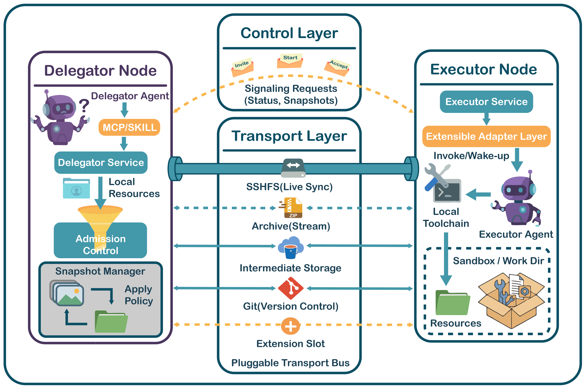
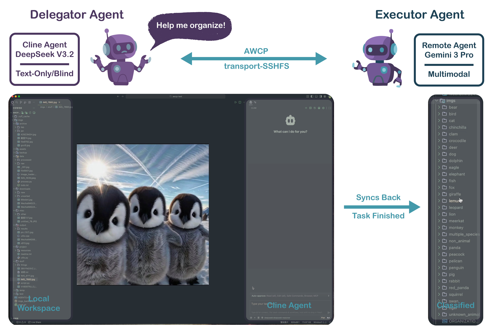
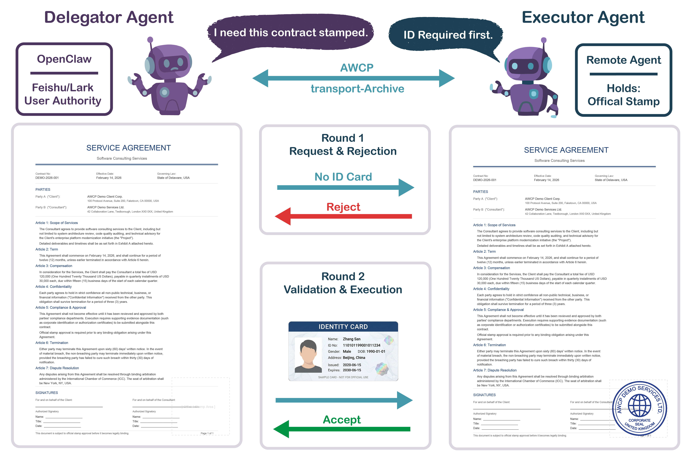

<p align="center">
  <h1 align="center">AWCP — Agent Workspace Collaboration Protocol</h1>
  <p align="center">
    <em>Bridging the context gap between isolated AI agents through workspace delegation</em>
  </p>
  <p align="center">
    <a href="https://www.npmjs.com/package/@awcp/core"></a>
    <a href="LICENSE"></a>
    <a href="https://github.com/SII-Holos/awcp/actions"></a>
  </p>
</p>

MCP lets agents call tools. A2A lets agents exchange messages. But **neither lets one agent work inside another's codebase**.

AWCP fills this gap. A Delegator agent projects its workspace—files, directories, build systems, version history—to a remote Executor, who operates on it with native toolchains as if everything were local. No file copying, no payload serialization, no environment reconstruction.

> 📄 **Paper**: _"AWCP: A Workspace Delegation Protocol for Deep-Engagement Collaboration across Remote Agents"_ — [Read on arXiv](https://arxiv.org/abs/2602.20493)

<br>

## Demo

See AWCP in action — a text-only coding agent delegates an image classification task to a multimodal agent through live workspace sharing:

<div align="center">

[](https://www.youtube.com/watch?v=IAMZa4zgGdI)

_▶ Click to watch on YouTube_

</div>

<br>

## The Problem: A Context Gap in the Agentic Web

Today's agent protocols cover **tool access** (MCP) and **task coordination** (A2A), but they operate strictly at the message layer. When a coding agent needs a security auditor to review its feature branch:

- **Via MCP** — the auditor can lint files one by one, but cannot navigate the repo, trace cross-file dependencies, or run whole-project analyzers.
- **Via A2A** — selected sources arrive as flat snapshots, stripped of the build system, version history, and test infrastructure.

What's actually needed is for the auditor to **step into the workspace** — with the full filesystem, the full context, and its own familiar tools.

AWCP makes this possible.

<br>

## How It Works

Inspired by the Unix philosophy that _everything is a file_, AWCP establishes a **files-as-interface** paradigm. The protocol separates a lightweight **control plane** (HTTP + SSE signaling) from a pluggable **transport layer** (how files actually move), enabling workspace delegation across diverse network conditions.

<div align="center">
  
</div>

The delegation lifecycle follows four phases, governed by dual state machines on each side:

```
  Delegator                                   Executor
      │                                           │
      │  ── INVITE (task, environment) ──────────>│  Negotiation
      │                                           │
      │  <── ACCEPT (workDir, constraints) ──────│
      │                                           │
      │  ── START (lease, transport handle) ─────>│  Provisioning
      │                                           │
      │           [ Executor works on files ]      │  Execution
      │  <── SSE: status updates ─────────────────│
      │  <── SSE: snapshots ──────────────────────│
      │                                           │
      │  <── DONE (summary, highlights) ──────────│  Completion
      │                                           │
      │  Reconcile results & cleanup              │
```

**Key design decisions:**

- **Executor controls its workspace** — the Delegator cannot dictate where files are mounted, preserving Executor autonomy.
- **Credentials are short-lived** — SSH certificates and leases have configurable TTLs with automatic cleanup.
- **Transport is orthogonal** — the same delegation logic works whether files travel via SSHFS, ZIP archive, cloud storage, or Git.

<br>

## Four Pluggable Transports

| Transport   | Mechanism        | Live Sync | Best For                                   |
| ----------- | ---------------- | :-------: | ------------------------------------------ |
| **SSHFS**   | SSH + FUSE mount |    ✅     | Interactive tasks, real-time collaboration |
| **Archive** | HTTP + ZIP       |     —     | Simple setup, small workspaces             |
| **Storage** | Pre-signed URLs  |     —     | Large files, cloud-native deployments      |
| **Git**     | Branch-based VCS |     —     | Auditable, versioned collaboration         |

Need something else? The adapter interface is open — implement your own for WebDAV, rsync, or any transport you need.

<br>

## Live Demonstrations

### Cross-Modal Dataset Curation (SSHFS)

<div align="center">
  
</div>

A text-only Delegator (Cline + DeepSeek V3.2) delegates a cluttered image directory to a multimodal Executor (Gemini 3 Pro). The Executor classifies, filters, and reorganizes 100+ images — changes synchronize bidirectionally in real time through the FUSE mount. The blind agent gains vision through delegation.

### Multi-Round Compliance Stamping (Archive)

<div align="center">
  
</div>

An OpenClaw agent on Feishu delegates contract stamping to a Compliance Auditor. Round 1 is rejected for missing identity verification; Round 2 succeeds after the user supplies the required document. Each round is a self-contained AWCP lifecycle — the protocol natively supports iterative workflows.

<br>

## Quick Start

### For Claude Desktop / Cline Users

Add AWCP as an MCP server to start delegating workspaces immediately:

```json
{
  "mcpServers": {
    "awcp": {
      "command": "npx",
      "args": ["@awcp/mcp", "--peers", "http://localhost:10200"]
    }
  }
}
```

Then ask your agent:

> _"Delegate the `./src` directory to another agent for code review."_

See [@awcp/mcp](packages/mcp/README.md) for all configuration options.

### For Developers

Install the SDK to build your own Delegator or Executor:

```bash
npm install @awcp/sdk @awcp/transport-archive
```

**Delegator** — share a workspace:

```typescript
import { startDelegatorDaemon, DelegatorDaemonClient } from "@awcp/sdk";
import { ArchiveDelegatorTransport } from "@awcp/transport-archive";

const daemon = await startDelegatorDaemon({
  port: 3100,
  delegator: {
    baseDir: "/tmp/awcp/environments",
    transport: new ArchiveDelegatorTransport({ tempDir: "/tmp/awcp/temp" }),
  },
});

const client = new DelegatorDaemonClient("http://localhost:3100");
const { delegationId } = await client.delegate({
  executorUrl: "http://executor-agent:10200/awcp",
  environment: {
    resources: [
      { name: "workspace", type: "fs", source: "./my-project", mode: "rw" },
    ],
  },
  task: {
    description: "Review and fix bugs in this project",
    prompt: "Please review the code and fix any issues you find.",
  },
});

const result = await client.waitForCompletion(delegationId);
console.log(result.result?.summary);
```

**Executor** — receive and work on a workspace:

```typescript
import express from "express";
import { executorHandler } from "@awcp/sdk/server/express";
import { A2ATaskExecutor } from "@awcp/sdk";
import { ArchiveExecutorTransport } from "@awcp/transport-archive";

const app = express();
const executor = new A2ATaskExecutor(myA2AExecutor);

const awcp = await executorHandler({
  executor,
  config: {
    workDir: "/tmp/awcp/workdir",
    transport: new ArchiveExecutorTransport({}),
  },
});

app.use("/awcp", awcp.router);
app.listen(10200);
```

<br>

## Packages

The implementation is a TypeScript monorepo (~8,500 lines of source, ~2,600 lines of tests):

| Package                                                 | Role                | Description                                                       |
| ------------------------------------------------------- | ------------------- | ----------------------------------------------------------------- |
| [`@awcp/core`](packages/core)                           | Protocol Foundation | Types, dual state machines (9-state + 4-state), error definitions |
| [`@awcp/sdk`](packages/sdk)                             | Services            | Delegator & Executor services, persistence, admission control     |
| [`@awcp/mcp`](packages/mcp)                             | Agent Integration   | 7 MCP tools covering the full delegation lifecycle                |
| [`@awcp/transport-archive`](packages/transport-archive) | Transport           | HTTP + ZIP, zero external infrastructure                          |
| [`@awcp/transport-sshfs`](packages/transport-sshfs)     | Transport           | SSH + FUSE mount, real-time bidirectional sync                    |
| [`@awcp/transport-storage`](packages/transport-storage) | Transport           | Pre-signed URLs for cloud-native deployments                      |
| [`@awcp/transport-git`](packages/transport-git)         | Transport           | Branch-based VCS with full audit trail                            |

<br>

## Requirements

- **Node.js** ≥ 18
- **SSHFS transport**: macOS: `brew install macfuse sshfs` · Linux: `apt install sshfs`
- **Git transport**: `git` CLI

## Documentation

| Resource                                      | Description                                                        |
| --------------------------------------------- | ------------------------------------------------------------------ |
| [Architecture Diagrams](docs/architecture.md) | Visual overview of system components and data flow                 |
| [MCP Tools Reference](packages/mcp/README.md) | Configuration and usage for Claude Desktop / Cline                 |
| [Development Guide](AGENTS.md)                | Architecture decisions and contribution guidelines                 |

## Roadmap

**Near-term**

- [ ] Executor adapter expansion — add a raw AWCP message adapter so any HTTP server can participate without an A2A dependency
- [ ] Redesigned examples and getting-started scenarios
- [ ] Complete the `delegate_recover` MCP tool (currently a stub)

**Mid-term**

- [ ] Python SDK implementation
- [ ] Security hardening — executor-side auth validation, lease expiration enforcement, sandbox profiles
- [ ] S3 storage provider for the Storage transport (currently local-only)

**Long-term**

- [ ] CRDT-based conflict resolution for concurrent workspace access
- [ ] Multi-agent coalitions — federated delegations across partitioned workspaces
- [ ] Dynamic executor discovery and capability advertisement

## Contributing

We welcome contributions — additional transports, language bindings (Python, Go, Rust), framework integrations, and documentation improvements. See [AGENTS.md](AGENTS.md) for development setup.

## Citation

If you use AWCP in your research, please cite:

```bibtex
@article{nie2026awcp,
  title={AWCP: A Workspace Delegation Protocol for Deep-Engagement Collaboration across Remote Agents},
  author={Nie, Xiaohang and Guo, Zihan and Chen, Youliang and Zhou, Yuanjian and Zhang, Weinan},
  journal={arXiv preprint arXiv:2602.20493},
  year={2026}
}
```

## License

[Apache 2.0](LICENSE)
